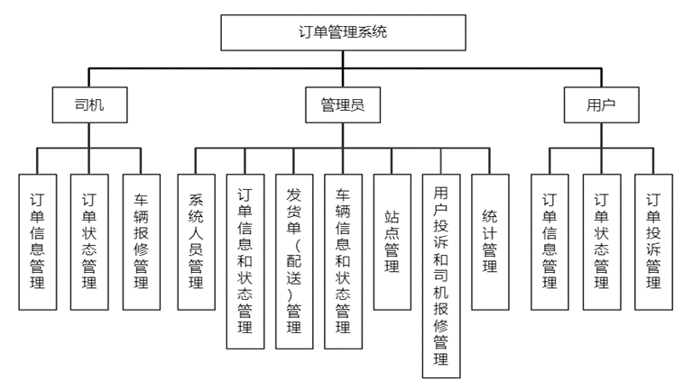
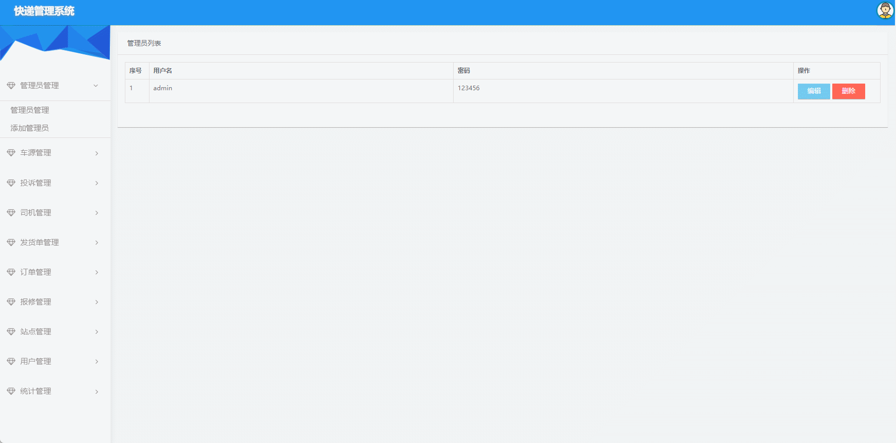
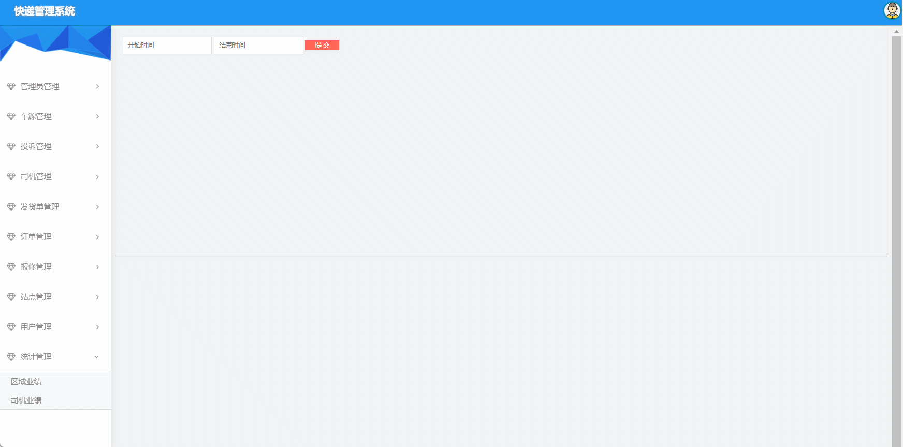

# express_ssm🎂

基于SSM+JSP的快递管理系统

## 介绍🌞

> 本系统的结构主要包含三个模块，即管理员、司机以及用户模块。其中，管理员模块中包含对司机和用户的管理、发货单管理、订单管理、站点管理、车源及报修管理、投诉管理和统计管理；司机模块中包含对发货单的管理和对车辆的保修管理；用户模块中包含订单管理以及对订单的投诉管理。在统计管理中，能查看区域业绩以及司机的业绩，是一个能观大局的模块，以此来做出对订单管理和人员的合理安排。该系统主要采用Java语言编写，后端使用SSM框架技术实现功能点，前端使用JSP页面展现视图以及使用MySQL数据库存储相关数据。

## 软件架构



## 项目演示🌞

> 管理员






> 司机


> 用户


## 安装教程🌞

```
1. 运行环境准备mysql8 + java8

2. 配置maven路径，加载依赖

3. 运行sql文件，确保application.yml或config.properties的数据库名称和账号密码是数据库所在主机的账号密码
```


## 使用说明🌞

```
1. 登入

    管理员账号：admin 密码：123456

    司机老张账号：driver1 密码：123456

    用户：user1 密码：123456
  
2. 运行流程

SpringBoot+Vue项目的部署详情可以查看这篇CSDN博客：http://t.csdnimg.cn/kpuxS

前后端不分离项目的部署流程可以查看这篇CSDN博客：http://t.csdnimg.cn/CslA5
```


## CSDN项目合集🌞

点击前往：http://t.csdnimg.cn/Q4u84


## 联系我🌞

**有偿获取完整源码或调试代码**

🐧：1902317191

wx：coding1902317191


